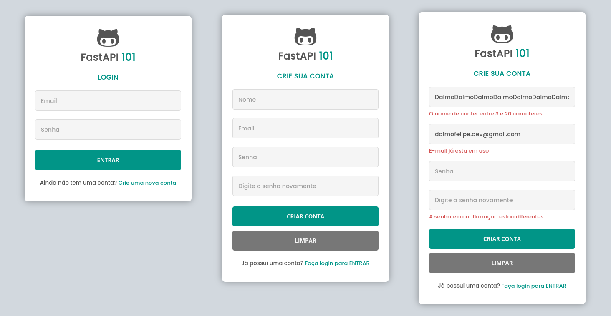

<h1 align="center">FastAPI 101</h1>

<p align="center">Sistema webapp simples para cadastro de usuários com FastAPI.</p>

<br>

[PyENV](https://github.com/pyenv/pyenv) | [Poetry](https://python-poetry.org/docs/) | [FastAPI](https://fastapi.tiangolo.com/) | [SQLModel](https://sqlmodel.tiangolo.com/) | [CSS Flex](https://css-tricks.com/snippets/css/a-guide-to-flexbox/) | [CSS GRID](https://css-tricks.com/snippets/css/a-guide-to-grid/)


### Preparar Ambiente

Definir versão do Python com PyENV

```bash
> pyenv install --list
> pyenv install 3.10.9
> pyenv global 3.10.9
> pyenv shell 3.10.9
```

Clonar projeto

```bash
> git clone https://github.com/dalmofelipe/FastApi101.git
```

Iniciar shell poetry

```bash
> cd FastApi101
> poetry shell
```

Instalar dependências do `pyproject.toml`

```bash
> poetry install
```

### Executando o Projeto

Criar arquivo `.env` na raiz do projeto. Configure `ENVIRONMENT=DEV`, o sqlite irá gerar o arquivo de dados `database.sqlite` no diretorio `fast/infra/`. Para modificar o local desse arquivo , edite no `.env` a variável `DB_DEV=sqlite:///novo/caminho/do/arquivo/database.sqlite`.

Para iniciar o servidor, usar o comando runserver da CLI

```bash
> fast runserver --port=3333
```

O server ficará escultando na porta 3333, no host http://localhost:3333.

Por padrão o app esculta a porta 8000, `--port=3333` é opcional.

Acesse a ajuda com os comandos:

```bash
> fast --help
> fast runserver --help
```

### ToDo

- [ ] Controlar Error 404 com página pessonalizada
- [ ] Refatorar registro de usuário, de modo que fique indempedente das interfaces api, cli e web
- [ ] Refortar registro de usuário com confirmação via link para o email registrado
- [ ] Criar layout da Dashboard administrativa
- [ ] Session? Salvar dados do usuário logado no navegador
- [ ] Gerar token JWT para comunicação com aplicação
- [x] Cadastro de usuários
- [x] Criptografia com Bcrypt de senha ao salvar no banco de dados
- [x] Webapp e API Rest
- [x] Variáveis de ambiente
- [x] Conexão com MySQL ou Postgres
- [x] Configurar o formatador de código blue


### Links

- [PyENV - https://github.com/pyenv/pyenv](https://github.com/pyenv/pyenv)
- [Poetry - https://python-poetry.org/docs/](https://python-poetry.org/docs/)
- [FastAPI - https://fastapi.tiangolo.com/](https://fastapi.tiangolo.com/)
- [SQLModel - https://sqlmodel.tiangolo.com/](https://sqlmodel.tiangolo.com/)
- [CSS Flex](https://css-tricks.com/snippets/css/a-guide-to-flexbox/)
- [CSS GRID](https://css-tricks.com/snippets/css/a-guide-to-grid/)
